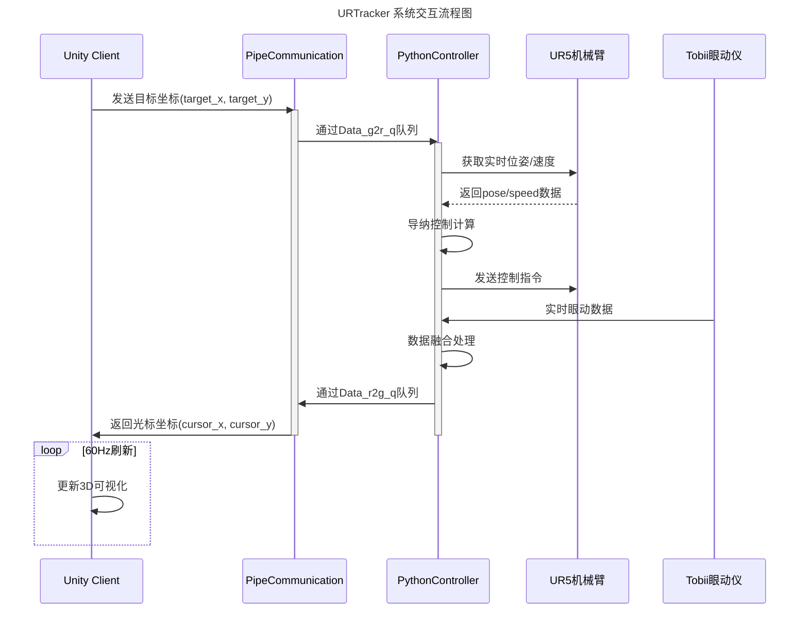

# URTracker_unity
这是一个unity版本的URTracker游戏，通过命名管道实现unity与python 控制器的交互
# URTracker_unity - Unity机械臂实时控制系统


## 项目概述
本系统通过命名管道实现Unity与Python控制器的双向实时通信，构建机械臂运动控制与可视化平台。包含以下核心模块：
- **Unity端**：3D可视化界面与用户交互
- **Python控制器**：导纳控制算法实现（`cc_admittance_2022.py`）
- **通信中间件**：跨进程管道通信模块（`PipeCommunication_0326.py`）
- **数据采集**：眼动仪集成与运动数据记录

## 主要功能
### 核心控制
- 🎮 六轴机械臂实时导纳控制
- ⚙️ 多模式参数动态切换（刚度/阻尼/质量矩阵）
- 📊 运动轨迹与力学数据实时记录

### 通信系统
- 📡 双向命名管道通信（C#/Python）
- 🔄 多线程数据队列管理（`queue.Queue`）
- 🌐 网络化机械臂控制（UR5 RTDE协议）

### 扩展功能
- 👁️ Tobii眼动仪集成
- 📈 动态参数自适应调整
- 🧪 仿真测试模式支持

## 环境要求
| 组件 | 版本要求 | 备注 |
|------|---------|------|
| Unity | 2021.3+ | 需安装Windows Build模块 |
| Python | 3.8+ | 需安装numpy, pandas, pygame等依赖 |
| 操作系统 | Windows 10/11 | 需启用命名管道支持 |
| 硬件 | UR5机械臂 | 需配置正确IP地址 |

## 快速启动
```bash
# Unity端（需在Editor中打开）
Assets/Scenes/MainScene.unity
```
```bash
# Python控制端
python Unity_py_comunicate/main.py
```

## 通信架构


## 核心参数配置
config.ini 示例：

```ini
[control]
max_velocity = 0.5    # m/s
max_acceleration = 0.5 # m/s²
frequency = 50        # Hz

[network]
ur_ip = 10.168.2.209
ur_port = 30003
pipe_timeout = 5000   # ms
```
## 数据结构
Unity-Python通信协议：

```csharp
// C# 数据结构
[Serializable]
public class ControlData {
    public float target_x;
    public float target_y;
    public float cursor_x;
    public float cursor_y;
    public float force_magnitude;
}
```
## 项目结构
```csharp
URTracker_unity/
├── Assets/
│   ├── Scripts/
│   │   └── NamedPipeClient.cs    # Unity管道通信模块
├── Unity_py_comunicate/
│   ├── UR5_admittance/
│   │   └── cc_admittance_2022.py # 导纳控制核心
│   ├── PipeCommunication_0326.py # 管道管理模块
│   └── main.py                   # 主控制程序
└── Docs/
    └── protocol_design.md        # 通信协议文档
```
## 故障排查
### Q: 机械臂无响应

1. 检查UR5 IP配置（``cc_admittance_2022.py``第36行）
2. 验证防火墙设置是否允许30003端口通信
3. 确认机械臂处于远程控制模式
### Q: 数据延迟过高

1. 降低Unity图形质量（Edit > Project Settings > Quality）
2. 调整管道缓冲区大小（PipeCommunication_0326.py第14行）
3. 优化控制频率（Admittance.__init__的frequency参数）
## 数据记录
实验数据包含以下维度：

```python
['time', 'target_x', 'target_y', 'cursor_x', 'cursor_y', 
 'Hex_x', 'Hex_y', 'Hex_z', 'force_norm', 
 'linear_x', 'linear_y', 'linear_z', 
 'pose_x', 'pose_y', 'pose_z', 
 'Gaze_x', 'Gaze_y']
 ```
## 许可协议
MIT License © 2023 Alibaba Cloud

